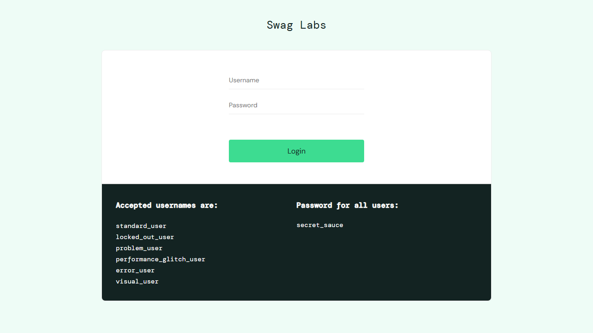
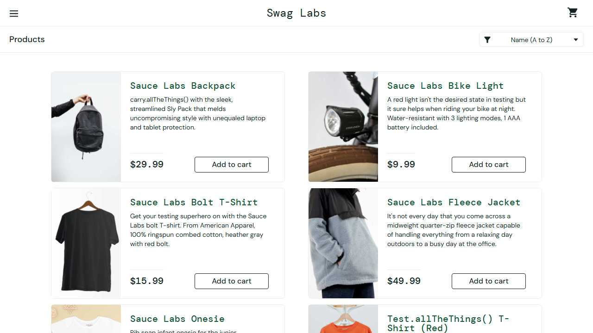

# 🐛 Bug Report

**Run date:** 02/07/2026, 14:54:49
**Result:** 6/8 passed — **2 FAILED**

---

## Failed Test Cases

### Bug #1 — should logout successfully

| Field | Detail |
|---|---|
| **Suite** | Login |
| **File** | `tests\e2e\login.spec.ts` |
| **Browser** | e2e |
| **Duration** | 7.6s |
| **Retries** | 0 |
| **Error** | Error: expect(page).toHaveURL(expected) failed  Expected: "https://www.saucedemo.com/dashboard" Received: "https://www.saucedemo.com/" |

**Screenshot:**

**Steps to reproduce:**

1. ✅ `Navigate to "/"`
2. ✅ `Fill "standard_user" getByTestId('username')`
3. ✅ `Fill "secret_sauce" getByTestId('password')`
4. ✅ `Click getByTestId('login-button')`
5. ✅ `Click getByRole('button', { name: 'Open Menu' })`
6. ✅ `Click getByText('Logout')`

**Expected:** Test should pass

**Actual:** Error: expect(page).toHaveURL(expected) failed  Expected: "https://www.saucedemo.com/dashboard" Received: "https://www.saucedemo.com/"

---

### Bug #2 — should login with performance glitch user

| Field | Detail |
|---|---|
| **Suite** | Login |
| **File** | `tests\e2e\login.spec.ts` |
| **Browser** | e2e |
| **Duration** | 11.9s |
| **Retries** | 0 |
| **Error** | Error: expect(page).toHaveURL(expected) failed  Expected: "https://www.saucedemo.com/inventory-missing" Received: "https://www.saucedemo.com/inventory.html" |

**Screenshot:**

**Steps to reproduce:**

1. ✅ `Navigate to "/"`
2. ✅ `Fill "performance_glitch_user" getByTestId('username')`
3. ✅ `Fill "secret_sauce" getByTestId('password')`
4. ✅ `Click getByTestId('login-button')`

**Expected:** Test should pass

**Actual:** Error: expect(page).toHaveURL(expected) failed  Expected: "https://www.saucedemo.com/inventory-missing" Received: "https://www.saucedemo.com/inventory.html"

---
